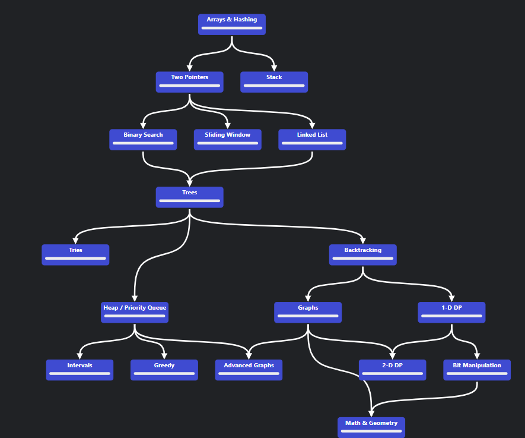

# Leetcode 💻
> My Data Structures and Algorithms practice workstation.

Here I will store my solutions to the leetcode problems, document my progress and comment the logic used. Feel free to interact 😉

## Roadmap

- [ ]  **Array**
    - [x]  Two Pointer Algorithm (e.g., finding pairs with a given sum)
    - [x]  Searching (Binary Search)
    - [ ]  Sorting
        - [ ] Bubble Sort
        - [ ] Merge Sort
        - [ ] Quick Sort
    - [ ]  Sliding Window (e.g., finding the maximum sum subarray of a given size)
    - [ ]  Dynamic Programming (e.g., Kadane’s Algorithm for Maximum Subarray Sum)
- [ ]  **Linked List**
    - [ ]  implement in C++ with the operations
    - [ ]  Reverse a Linked List
    - [ ]  Detect Cycle in a Linked List (Floyd’s Cycle Detection Algorithm)
    - [ ]  Merge Two Sorted Linked Lists
    - [ ]  Find the Middle of a Linked List
    - [ ]  Remove N-th Node from the End
- [ ]  **Stack**
    - [ ]  Balanced Parentheses
    - [ ]  Implement a Queue using Stacks
    - [ ]  Evaluate Reverse Polish Notation
    - [ ]  Next Greater Element
    - [ ]  Min Stack
- [ ]  **Queue**
    - [ ]  Implement Stack using Queues
    - [ ]  Circular Queue
    - [ ]  Sliding Window Maximum
    - [ ]  Rotten Oranges (Matrix BFS)
    - [ ]  Binary Tree Level Order Traversal
- [ ]  **Hash Table (Hash Map)**
    - [ ]  Two Sum
    - [ ]  Group Anagrams
    - [ ]  Longest Substring Without Repeating Characters
    - [ ]  Subarray Sum Equals K
    - [ ]  Design a Hash Map
- [ ]  **Heap (Priority Queue)**
    - [ ]  Kth Largest Element in an Array
    - [ ]  Merge K Sorted Lists
    - [ ]  Top K Frequent Elements
    - [ ]  Sliding Window Median
    - [ ]  Find Median from Data Stream
- [ ]  **Tree**
    - [ ]  Binary Tree Inorder Traversal (recursive and iterative)
    - [ ]  Validate Binary Search Tree
    - [ ]  Lowest Common Ancestor
    - [ ]  Serialize and Deserialize Binary Tree
    - [ ]  Binary Tree Maximum Path Sum
- [ ]  **Graph**
    - [ ]  Depth-First Search (DFS)
    - [ ]  Breadth-First Search (BFS)
    - [ ]  Dijkstra’s Algorithm
    - [ ]  Detect Cycle in an Undirected/Directed Graph
    - [ ]  Topological Sort
- [ ]  **Trie**
    - [ ]  Implement a Trie (Insert, Search, and Delete)
    - [ ]  Word Search II
    - [ ]  Longest Word in Dictionary
    - [ ]  Replace Words
    - [ ]  Maximum XOR of Two Numbers in an Array
     
https://neetcode.io/roadmap

